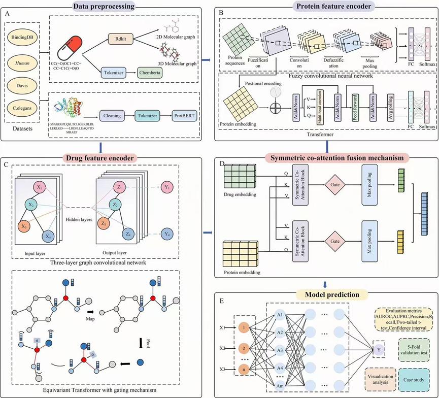

## 🧬 FEGA-DTI: An interpretable framework for drug-target interaction prediction based on fuzzy convolution neural network and equivariant Transformer

This repository provides the implementation of **FEGA-DTI**, a Drug–Target Interaction (DTI) prediction framework integrating:

* **Drug feature extraction** (ChemBERTa, GCN/Equivariant Transformer)
* **Protein feature extraction** (ProtBERT / FuzzyCNNTransBlock)
* **Feature fusion module** (Co-Attention + Self-Attention)
* **Training / evaluation code** with ROC/PR visualization
* **Attention weight and feature map visualization support**

---

## 🔧 Overall Architecture

```
Drug SMILES → ChemBERTa / GCN / Equivariant Transformer → Drug Embedding
Protein Sequence → ProtBERT / ESM-2 / FuzzyCNNTransBlock → Protein Embedding
                       │
                       ▼
              Co-Attention Fusion Module
                       │
                       ▼
            Classification / Interaction Score
```

### 📌 Model Diagram

)

## 📁 Project Structure

```
FEGA-DTI/
│── egnn_pytorch/           # Equivariant Transformer 
│── Proteinencoder/        # ProtBERT / ESM-2 / FuzzyCNNTransBlock
│── Integrate/                 # Co-Attention fusion module
│── datasets/               # BindingDB / Human / Davis / C.elegans
│── utils/                  # preprocessing, metrics, visualization
│── trainer.py              # Training manager
│── main.py                 # Pipeline entry
│── README.md
```

Each dataset includes:

```
train.csv
val.csv
test.csv
```

---

## 🛠️ Training & Testing

Run:main.py

Thanks for providing all modules used in constructing this consolidated README.
